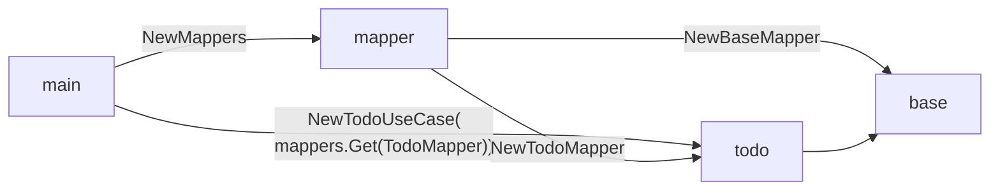
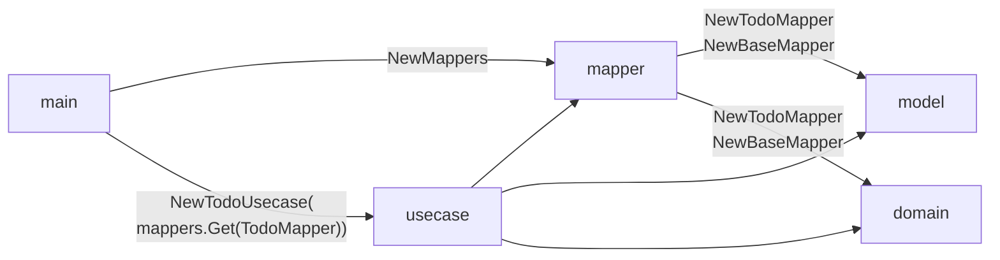

# sesame

[](https://pkg.go.dev/github.com/yuin/sesame)
[](https://github.com/yuin/sesame/actions?query=workflow:test)
[](https://goreportcard.com/report/github.com/yuin/sesame)

> An object-to-object mapper generator for Go that can 'scale'

## Why the name 'sesame'?
sesame is a **go** **ma**pper. Japanese often abbreviate this kind of terms as 'goma'.
[Goma](https://ja.wikipedia.org/wiki/%E3%82%B4%E3%83%9E) means the sesame in Japanese.


## Motivation
Multitier architectures like good-old 3tier architecture, Clean architecture, Hexagonal architecture etc have similar objects in each layers.

It is a hard work that you must write so many bolierplate code to map these objects. There are some kind of libraries(an object-to-object mapper) that simplify this job using reflections.

Object-to-object mappers that use reflections are very easy to use, but these are difficult to 'scale' .

- Hard to debug: Objects in the real world, rather than examples, are often very large. In reflection-based libraries, it can be quite hard to debug if some fields are not mapped correctly.
- Performance: Go's reflection is fast enough for most usecases. But, yes, large applications that selects multitier architectures often have very large objects. Many a little makes a mickle.

sesame generates object-to-object mappers source codes that **DO NOT** use reflections.

## Status
This project is in very early stage. 
Any kind of feedbacks are wellcome.

## Features

- **Fast** : sesame generates object-to-object mappers source codes that **DO NOT** use reflections in mapping logics.
- **Easy to debug** : If some fields are not mapped correctly, you just look a generated mapper source codes.
- **Flexible** : sesame provides various way to map objects.
  - By name
    - Simple field to field mapping
    - Field to nesting field mapping like `TodoModel.UserID -> TodoEntity.User.ID` .
    - Embedded struct mapping
  - By type
  - By helper function that is written in Go
  - By conterter that is written in Go
- **Zero 3rd-party dependencies at runtime** : sesame generates codes that depend only standard libraries.
- **Scalable** : 
  - Fast, Easy to debug and flexible. 
  - Mapping configurations can be separated into multiple files.
    - You do not have to edit over 10000 lines of a single YAML file that has 1000 mapping definitions.

## Current limitations
- Your project must be a Go module.

## Installation
#### `sesame` command
#### Binary installation
Get a binary from [releases](https://github.com/yuin/sesame/releases) .

#### go get
sesame requires Go 1.20+.

```bash
$ go install github.com/yuin/sesame/cmd/sesame@latest
```

#### Library

```bash
$ go get -u github.com/yuin/sesame
```

## Usage
### Outline

1. Install the `sesame` command.
1. Add `github.com/yuin/sesame` to your `go.mod` file.
1. Create a configuration file(s).
2. Run the `sesame` command.
3. Create a `Mappers` object in your code.
4. (Optional) Add helpers and converters.
5. Get a mapper from `Mappers`.
6. Map objects by the mapper.

See [tests](https://github.com/yuin/sesame/tree/master/testdata) for examples.

### Objects
sesame consists of 3 kind of objects: **Mapper**, **Converter**, and **Helper** .

#### Mapper
Mappers map struct fields from A to B and B to A.  Mappers only work when source
object is not nil.

Mapper has methods like the following:

```go
type TodoMapper interface {
	TodoModelToTodo(pkg00000.Context, *pkg00001.TodoModel, *pkg00002.Todo) error
	TodoToTodoModel(pkg00000.Context, *pkg00002.Todo, *pkg00001.TodoModel) error
}
```

Source and destination arguments are always pointers.

#### Converter
Converters convert a value from A to B and B to A. Converters work even if source object is nil.

Converter has methods like the following:

```go
type TimeStringConverter struct {
}

func (m *TimeStringConverter) StringToTime(ctx context.Context, source *string) (*time.Time, error) {
	if source == nil {
		return nil, nil
	}
	t, err := time.Parse(time.RFC3339, source)
	if err != nil {
		return nil, err
	}
	return &t, nil
}

func (m *TimeStringConverter) TimeToString(ctx context.Context, source *time.Time) (string, bool, error) {
	if source == nil {
		return "", true, nil
	}
	return source.Format(time.RFC3339), false, nil
}
```

A source argument is a pointer or an interface. Returned value types will be a:

- primitive types(i.e. `string`, `int`, ... `array`): `value, isnil, error`
  - example: returns `string, bool, error`
    - if `isnil` is true and a mapping destination is a pointer, the destination will be nil.
- slices, maps: `value`, `error`
  - example: returns `[]int, error`
- interface: `interface`, `error`
- others: `pointer, error`

Note that a source argument can be nil.

### Differences between Mapper and Converter

- Mapper is used for mapping struct fields. source and destination arguments are always struct pointers.
- Other conversions are done by Converters. source and destination argument can be any types.

### Naming convention

- Mapper id must end with "Mapper" like "TodoMapper"
- Converter id  must end with "Converter" like "TimeStringConverter"
- Helper id must be "${MAPPER_ID}Helper"
- Mapper function name must be "XxxToYyy"
- Converter function name must be "XxxToYyy"

### Mapping configuration file
sesame uses mapping configuration files written in YAML. 

`${YOUR_GO_MODULE_ROOT}/sesame.yml`:

```yaml
mappers:                                         # configurations for a mapper collection
  package: mapper                                # package name for generated mapper collection
  destination: ./mapper/mappers_gen.go           # destination for generation
  nil-map: nil                                   # how are nil collections mapped
  nil-slice: nil                                 #   a value should be one of 'nil', 'empty' (default: nil)
mappings:                                        # configurations for object-to-object mappings
  - name: TodoMapper                             # name of the mapper
    id:   mymappers.TodoMappers                  # id of the mapper. This must be unique within all mappers.
                                                 # if id is not set, name will be used as id.
    package: mapper                              # package name for generated mapper
    destination: ./mapper/todo_mapper_gen.go     # definition for generation
    bidirectional: true                          # generates a-to-b and b-to-a mapping if true(default: false)
    a-to-b: ModelToEntity                        # mapping function name(default: `{AName}To{BName}`)
    b-to-a: EntityToModel                        # mapping function name(default: `{BName}To{AName}`)
    a:                                           # mapping operand A
      package: ./model                           # package path for this operand
      name: TodoModel                            # struct name of this operand
    b:                                           # mapping operand B
      package: ./domain
      name: Todo
    explicit-only: false                         # sesame maps same names automatically if false(default: false)
    allow-unmapped:false                         # sesame fails with unmapped fields if false(default: false)
                                                 #   This value is ignored if `explicit-only' is set true.
    ignore-case:   false                         # sesame ignores field name cases if true(default: false)
    nil-map: nil                                 # how nil collections are mapped
    nil-slice: nil                               #   a default value is inherited from mappers
    fields:                                      # relationships between A fields and B fields
      - a: Done                                  #   you can define nested mappings like UserID
        b: Finished                              #   you can define mappings for embedded structs by '*'
      - a: UserID                                # 
        b: User.ID                               #
      - a: Address
      - b: Address
        uses: AddressConverter                   # instead of global one, you can use a converter for this field
                                                 #
      - a: IntList                               # if a field is a collection, you can define `uses` or `uses-for-elements`.
        b: StringList                            # with `uses` sesame uses the converter for the whole collection.
        uses-for-elements: StringIntConverter    # with `uses-for-elements` sesame uses the converter for each element.
                                                 #
    ignores:                                     # ignores fields in operand X
      - a: ValidateOnly
      - b: User
_includes:                                       # includes separated configuration files
  - ./*/**/*_sesame.yml
```

And now, you can generate source codes just run `sesame` command in `${YOUR_GO_MODULE_ROOT}`.

Generated mappers are added as globals. Generated mappers will use global mappers if target
objects have fields that any global mappers can map/convert to other types.

This configuration will generate the codes like the following:

`./mapper/todo_mapper_gen.go` :

```go
package mapper

import (
	pkg00000 "context"
	pkg00003 "time"

	pkg00002 "example.com/testmod/domain"
	pkg00001 "example.com/testmod/model"
)

type TodoMapperHelper interface {
	TodoModelToTodo(pkg00000.Context, *pkg00001.TodoModel, *pkg00002.Todo) error
	TodoToTodoModel(pkg00000.Context, *pkg00002.Todo, *pkg00001.TodoModel) error
}

type TodoMapper interface {
	TodoModelToTodo(pkg00000.Context, *pkg00001.TodoModel, *pkg00002.Todo) error
	TodoToTodoModel(pkg00000.Context, *pkg00002.Todo, *pkg00001.TodoModel) error
}

// ... (TodoMapper default implementation)
```

### Mapping in your code
sesame generates a mapper collection into the `mappers.destination` .
Mapping codes look like the following:

1. Create new Mappers object as a singleton object. The Mappers object is a groutine-safe.

   ```go
   mappers := mapper.NewMappers()           // Creates new `Mappers` object with generated mappers
   mappers.Add("TimeToStringConverter", &TimeStringConverter{})  // Add converter
   mappers.Add("TodoMapperHelper", &todoMapperHelper{}) // Add helpers
   ```

2. Get a mapper and call it for mapping.

   ```go
   obj, err := mappers.Get("TodoMapper")    // Get mapper by its name
   if err != nil {
       t.Fatal(err)
   }
   todoMapper, _ := obj.(TodoMapper)
   var entity Todo
   err := todoMapper.ModelToEntity(ctx, model, &entity) 
   ```

   `sesame.Get` is a helper object that provides type-safe `Get` method.

   ```go
   todoMapper, err := sesame.Get[TodoMapper](mappers)
   ```

### Add Converters
By default, sesame can map following types:

- Same types
- Castable types(i.e. `int -> int64`, `type MyType int <-> int`)
- `map`, `slice` and `array`

For others, you can write and register converters.

Example: `string <-> time.Time` mapper

```go
type TimeStringConverter struct {
}

func (m *TimeStringConverter) StringToTime(ctx context.Context, source *string) (*time.Time, error) {
	if source == nil {
		return nil, nil
	}
	t, err := time.Parse(time.RFC3339, source)
	if err != nil {
		return nil, err
	}
	return &t, nil
}

func (m *TimeStringConverter) TimeToString(ctx context.Context, source *time.Time) (string, bool, error) {
	if source == nil {
		return "", true, nil
	}
	return source.Format(time.RFC3339), false, nil
}

func AddTimeToStringConverter(mappers Mappers) {
	stringTime := &TimeStringConverter{}
	mappers.Add("TimeStringConverter", stringTime) // add as globals
	// add as no-globals. `uses` or `uses-for-elements` in the configuration file can use this converter.
	// mappers.Add("TimeStringConverter", stringTime, sesame.WithNoGlobals()) 
                                             
}
```


### Helpers
You can define helper functions for more complex mappings.

```go
type todoMapperHelper struct {
}

var _ TodoMapperHelper = &todoMapperHelper{} // TodoMapperHelper interface is generated by sesame

func (h *todoMapperHelper) ModelToEntity(ctx context.Context, source *model.TodoModel, dest *domain.Todo) error {
    if source.ValidateOnly {
        dest.Attributes["ValidateOnly"] = []string{"true"}
    }
    return nil
}

func (h *todoMapperHelper) EntityToModel(ctx context.Context, source *domain.Todo, dest *model.TodoModel) error {
    if _, ok := source.Attributes["ValidateOnly"]; ok {
        dest.ValidateOnly = true
    }
    return nil
}
```

and register it as `{MAPPER_ID}Helper`:

```go
mappers.Add("TodoMapperHelper", &todoMapperHelper{})
```

Helpers will be called at the end of the generated mapping implementations.

### Lazy loading/Mapper depends on other mappers
`AddFactory` method allows you to define a factory function that returns a mapper object.

interfaces:

```go
type MyMapper interface {
    // ...
}

sesame.AddFactory[MyMapper](mappers, "MyMapper", func(m sesame.MapperGetter) (MyMapper, error) {
    // you can get other mappers and converts from m
    return &myMapper{}, nil
})
```

structs:

```go
type MyMapper struct {
    // ...
}

sesame.AddFactory[*MyMapper](mappers, "MyMapper", func(m sesame.MapperGetter) (*MyMapper, error) {
    return &MyMapper{}, nil
})
```

You can add factories using reflections instead of `sesame.*` type-safe functions:

```go
// MyMapper is an interface, so you must use `Elem()`
mappers.AddFactory("MyMapper", reflect.TypeOf((*MyMapper)(nil)).Elem(), func(m sesame.MapperGetter) (any, error) {
    return &myMapper{}, nil
})
```

2nd argument of `AddFactory` must be a `reflect.Type` of a mapper interface or a `reflect.Type` of a mapper struct pointer.
Note that Go can not get interface type from nil interface value. You must use a interface pointer and its `Elem()`.
### Recommended project structure
Package relations with generated Go files are:

- Generated `Mappers` depends on all generated `Mapper`s
- Generated `Mapper`s depends on mapping targets

**Examples (1):**

```
/
+-- mapper/
|   +-- mappers_gen.go  : generated `Mappers`
|   +-- mapper.go       : add hand-written mappers, converters and helpers
+-- todo/               : contains `base` elements like `struct Todo{base.Entity}`
|   +-- todo_mapper_gen.go : generated `Mapper`
|   +-- todo_model.go   : model definition
|   +-- todo_entity.go  : entity definition
|   +-- todo_usecase.go : business logic uses a `Mapper`
+-- base/
|   +-- base_mapper_gen.go : generated `Mapper`
|   +-- base_model.go   : model definition
|   +-- base_entity.go  : entity definition
+ cmd/main/main.go : create `Mappers`, `Mapper`  and `TodoUsecase`
```



**Examples (2):**

```
/
+-- mapper/
|   +-- mappers_gen.go  : generated `Mappers`
|   +-- mapper.go       : add hand-written mappers, converters and helpers
|   +-- todo_mapper_gen.go : generated `Mapper`
|   +-- base_mapper_gen.go : generated `Mapper`
+-- model/
|   +-- todo_model.go   : model definition
|   +-- base_model.go   : model definition
+-- domain/
|   +-- todo_entity.go  : entity definition
|   +-- base_entity.go  : entity definition
+-- usecase/
|   +-- todo_usecase.go : business logic uses a `Mapper`
+ cmd/main/main.go : uses `Mappers`, `Mapper` and `TodoUsecase`
```



### Merge mappers

```go
mappers := domain_mappers.NewMappers()
err := mappers.Merge(grpc_mappers.NewMappers())
// Now mappers have all mappers defined in domain_mappers and grpc_mappers
// If there are objects with the same id, grpc_mappers' objects are used.
// If there are globals for same types, grpc_mappers' objects are used.
```

Note that merging must be done before any `Get` calls.


## Donation
BTC: 1NEDSyUmo4SMTDP83JJQSWi1MvQUGGNMZB

## License
MIT

## Author
Yusuke Inuzuka
